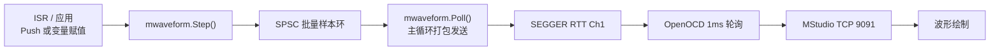

# MODUS 实时波形采集 (mwaveform) 深度指南

`mwaveform` 是 MODUS 里的实时波形采集模块。它负责把 MCU 里的控制变量、电流、角度、速度等数据，以二进制帧方式通过 SEGGER RTT 送到上位机 MStudio 绘制。

当前实现支持：

- 连续实时流：例如 1 kHz、5 kHz、10 kHz。
- 每通道/每变量独立刷新率：一个流里可以混合 10 kHz 和 1 kHz 变量。
- 批量帧传输、CRC 校验、丢帧统计、RTT 拥塞统计。

---

## 1. 数据链路



MCU 侧分两个角色：

- Producer：高频 ISR 里更新变量或调用 `Push`，然后调用 `Step()`。
- Consumer：主循环里的 `Poll()` 把样本环打包成 batch 帧，再通过 RTT 发送。

`modus_Run()` 会自动调用 `mwaveform.Poll()`。如果你没有用 `modus_Run()`，需要在主循环里手动调用。

---

## 2. 两种变量注册方式

### 2.1 `AddVariable`：绑定变量地址

推荐用于“变量一直在被业务代码更新”的情况。

```c
static volatile int16_t s_raw_iu;
static volatile float   s_id;

uint8_t ch_iu = mwaveform.AddVariable(
    "Iu", 1.0f, (void *)&s_raw_iu, MWAVEFORM_VAR_RAW);

uint8_t ch_id = mwaveform.AddVariable(
    "Id", 1000.0f, (void *)&s_id, MWAVEFORM_VAR_FLOAT);
```

- `MWAVEFORM_VAR_RAW`：按 `int16_t` 读取地址。
- `MWAVEFORM_VAR_FLOAT`：按 `float` 读取地址。
- 绑定后不需要为这个变量单独调用 `Push`。
- 当这个通道的分频到期时，`Step()` 内部会直接读取绑定地址。

### 2.2 `AddChannel` + `Push`：显式喂值

适合临时计算值、非变量类型、或者需要由应用决定何时采样的通道。

```c
uint8_t ch_temp = mwaveform.AddChannel("Temp", 100.0f);

/* ISR 或其他业务代码里 */
mwaveform.Push(ch_temp, temperature);
```

`Push` 只写当前值并置位通道掩码，真正的采样由 `Step()` 完成。

---

## 3. 配置

### 3.1 常用配置宏

| 宏 | 库默认 | 当前工程 | 说明 |
| :--- | :--- | :--- | :--- |
| `MWAVEFORM_ENABLE` | 0 | 1 | 编译开关 |
| `MWAVEFORM_MAX_CHANNELS` | 16 | 9 | 最大通道数，影响 mask 宽度和 RAM |
| `MWAVEFORM_RTT_BUFFER_SIZE` | 1024 | 4096 | waveform 专用 RTT 上行缓冲 |
| `MWAVEFORM_BATCH_ENABLE` | 1 | 1 | 启用批量帧模式 |
| `MWAVEFORM_BATCH_SIZE` | 64 | 64 | 每批最多样本数 |
| `MWAVEFORM_BATCH_DEPTH` | 128 | 128 | 批量样本环深度 |
| `MWAVEFORM_BATCH_FLUSH_MS` | 10 | 10 | 样本不足 64 时的超时刷新 |

### 3.2 RTT 与 OpenOCD

waveform 使用 RTT up buffer 1，shell/log 使用 buffer 0。

当前工程启动 OpenOCD RTT 时使用：

```text
rtt polling_interval 1
rtt server start 9090 0
rtt server start 9091 1
```

- `9090`：MStudio shell 通道。
- `9091`：MStudio waveform 通道。
- 1ms 轮询是当前 10 kHz 连续流的基础配置。

`MWAVEFORM_RTT_BUFFER_SIZE` 越大，MCU 在 OpenOCD 来不及读时的缓存能力越强，但会占用更多 RAM。

---

## 4. 初始化与运行

### 4.1 推荐初始化流程

```c
void app_waveform_init(void)
{
    mwaveform.Init(NULL);

    uint8_t ch_iu = mwaveform.AddVariable(
        "Iu", 1.0f, (void *)&s_raw_iu, MWAVEFORM_VAR_RAW);
    uint8_t ch_id = mwaveform.AddVariable(
        "Id", 1000.0f, (void *)&s_id, MWAVEFORM_VAR_FLOAT);

    /* 外部驱动模式：由应用 ISR 自己调用 Step */
    mwaveform.SetRate(0);

    /* ISR 20kHz，目标连续流 10kHz */
    mwaveform.SetStreamRate(50000, 10000);

    /* Id 只按 1kHz 进入实时流 */
    mwaveform.SetChannelRate(ch_id, 1000);

    mwaveform.Start();
}
```

### 4.2 高频 ISR

```c
void HighFrequencyISR(void)
{
    s_raw_iu = read_current_u();
    s_id     = controller_id_output();

    /* 根据流率和通道分频决定本次样本包含哪些通道 */
    mwaveform.Step();

}
```

### 4.3 主循环

```c
while (1) {
    modus_Run(); /* 内部会调用 mwaveform.Poll() */
}
```

---

## 5. 三种使用模式

### 5.1 连续实时流

适用场景：长时间观察 10 kHz 以内的变量。

```c
mwaveform.SetStreamRate(50000, 10000); /* 返回实际流率 */
mwaveform.Start();
```

- 10 kHz：每 100us 一个样本。
- 5 kHz：每 200us 一个样本。
- 数据不是逐样本发送，而是攒成 64 个样本的 batch 帧发送。

### 5.2 每变量独立刷新率

适用场景：一个流里同时观察高频和低频变量。

```c
uint8_t ch_iq = mwaveform.AddVariable(
    "Iq", 1000.0f, (void *)&s_iq, MWAVEFORM_VAR_FLOAT);
uint8_t ch_speed = mwaveform.AddVariable(
    "Speed", 1000.0f, (void *)&s_speed, MWAVEFORM_VAR_FLOAT);

mwaveform.SetStreamRate(50000, 10000);

mwaveform.SetChannelRate(ch_iq, 10000);   /* 每样本都有 */
mwaveform.SetChannelRate(ch_speed, 1000); /* 每 10 样本一次 */
```

注意：

- `SetChannelRate(ch, 0)` 表示每个 stream 样本都包含该通道。
- 实际频率按 stream 率整数分频。10 kHz stream 下常见结果为 5k、3.333k、2.5k、2k、1k、500Hz 等。
- 对于 `AddVariable`，只需要持续更新绑定地址，`Step()` 会在分频到期时读取。
- 对于 `AddChannel + Push`，仍需要按业务节奏调用 `Push`。

---

## 6. 内部机制

### 6.1 `Step()`：采样入环

`Step()` 负责：

1. 按 `chDecimation` 决定本次是否产生 stream 样本。
2. 按每个通道的 `SetChannelRate` 分频生成通道 mask。
3. 读取 `AddVariable` 绑定的地址。
4. 把当前样本复制到 SPSC 批量样本环。
5. 如果样本环满，则 `DropCount++`。

### 6.2 `Poll()`：打包发送

`Poll()` 负责：

1. 攒满 `MWAVEFORM_BATCH_SIZE` 或超时 `MWAVEFORM_BATCH_FLUSH_MS`。
2. 把样本环中的连续样本打包成 `AA 55 FC` batch 帧。
3. 调用 `SEGGER_RTT_Write()` 写入 RTT Ch1。
4. 如果 RTT 空间不足，整帧保留并稍后重试，同时 `RTTFullCount++`。

### 6.3 帧类型

| 帧 | 用途 |
| :--- | :--- |
| `AA 55 FD` | 通道描述符 |
| `AA 55 FE` | 采样周期元数据 |
| `AA 55 FC` | 批量实时流帧 |
| `AA 55 [seq]` | 旧单点帧，兼容保留 |

batch 使用 CRC16；descriptor/meta 使用 CRC8。

---

---

## 7. 当前实测结论

当前工程在 4096 字节 RTT 缓冲 + OpenOCD 1ms 轮询下：

- 10 kHz 连续流：MCU 侧可以做到 0 丢帧。
- 60 秒监控中 host 侧约 1 次 CRC 错误，属于偶发 RTT 读取竞争，不是 MCU 丢帧。

---

## 9. 常见问题

### Q1. 为什么没有波形？

确认：

- 应用已调用 `mwaveform.Start()`，并且 ISR 正在执行 `Step()`。
- MStudio Ch1 已连接。
- ISR 正在调用 `Step()`。
- 电机/被观察对象正在运行。
- Dashboard `Actual` 不是 0。

### Q2. 波形有断裂？

先看 `mwaveform.GetDropCount()`、`mwaveform.GetRTTFullCount()` 和 MStudio `Gap`：

- MCU drop 增加：说明样本环满，降低流率、通道数，或增大 RTT 缓冲。
- MCU drop 为 0 但 Gap 增加：说明 RTT/host 读取链路有丢包或 CRC 错误。

### Q3. 为什么 5 kHz 比 10 kHz 更稳？

5 kHz 数据量只有 10 kHz 的一半，RTT 缓冲更容易被及时消费。

---

> [!TIP]
> 波形通道在初始化阶段注册并配置刷新率；运行阶段由应用调用 `Step()`，主循环调用 `Poll()`。
